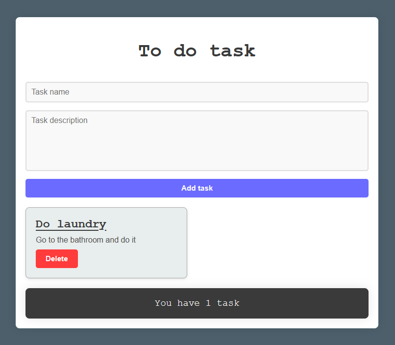

# React - To do list

# 🔗 [Live Preview]()

---

## About 👋

The To-Do Task Manager is a simple and elegant application designed to help you manage your tasks efficiently. This project demonstrates the use of React to create a dynamic and interactive user interface for adding, displaying, and managing tasks. The focus is on React useState practice.

---

## Features 👨‍💻

-   **Add Tasks**: Easily add new tasks with a task name and description.

-   **Delete Tasks**: Remove tasks that are no longer needed.

-   **Dynamic Task Count**: The footer dynamically updates to show the number of tasks you have.

---

Explanation 🧠

TO ADD

---

## Languages

- React: functions, conditionals, useState
- Styling: basic